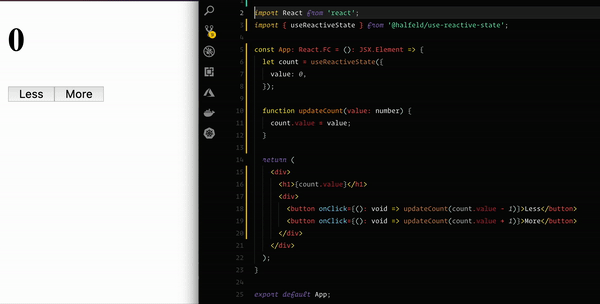

<p align="center">
  <h2 align="center">
    useReactiveState(🔥)
  </h2>
  <p align="center">Data binding incorporation in React world.</p>
</p>

<p align="center">
  
</p>

### How to install

```sh
npm install @halfeld/use-reactive-state
```

### How to use

```javascript
import React from 'react';
import { useReactiveState } from '@halfeld/use-reactive-state';

const App = () => {
  let count = useReactiveState({ value: 0 });

  function updateCount(value: number) {
    count.value = value;
  }

  return (
    <div>
      <h1>{count.value}</h1>
      <div>
        <button onClick={(): void => updateCount(count.value - 1)}>Less</button>
        <button onClick={(): void => updateCount(count.value + 1)}>More</button>
      </div>
    </div>
  );
}
```